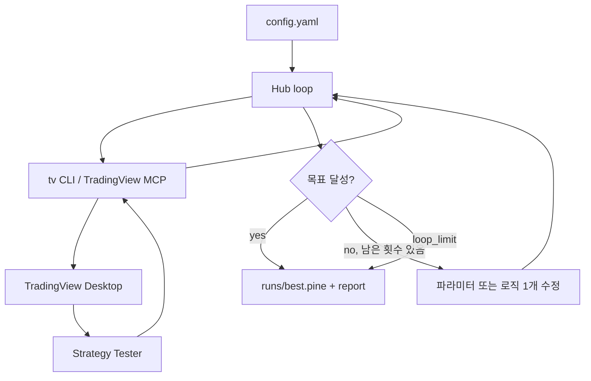

# Architecture

## 왜 이렇게 나눴나

TradingView 백테스트는 **차트 앱 안에서** 돌아감. 허브는 가격 데이터를 따로 받지 않고, star가 가장 많은 MCP인 [tradesdontlie/tradingview-mcp](https://github.com/tradesdontlie/tradingview-mcp) 로 Desktop Strategy Tester를 조작함.

레퍼런스:

- MCP 파인 루프: `pine_set_source` → `pine_smart_compile` → `pine_get_errors` → `data_get_strategy_results`
- 리포트 형식: 같은 레포의 `skills/strategy-report`
- “한 사이클에 가설 하나”: [DaviddTech/ai-trading-agent](https://github.com/DaviddTech/ai-trading-agent) 의 strategy optimizer loop

## 구성

```
progress.md                  지금 / 남은 일 / 최근 한 일
decisions.md                 큰 방향 전환 기록
config/default.yaml          종목, loop_limit, 목표 수익률
pinescript/*.pine            허브가 주입하는 기본 전략
pinescript/reference/        기존에 돌아가던 전략 원본 (덮어쓰지 않음)
src/hub/                     Python 뼈대 (주입/채점/파라미터 탐색)
src/hub/web.py               debug 연동 안내 페이지
.cursor/mcp.json             Cursor TradingView MCP
.cursor/skills/              Cursor 에이전트가 MCP로 로직을 고칠 때 쓰는 플로우
.cursor/plans/               Cursor Plan 초안만 (진행 목록 아님)
vendor/tradingview-mcp       tradesdontlie MCP clone
```



## 실행 모드

| mode | 누가 스크립트를 고치나 | 언제 쓰나 |
|------|------------------------|----------|
| `params` | Python이 `HUB:` 태그가 붙은 input 값만 바꿈 | 자동 파라미터 탐색 |
| `agent` | 한 번 백테스트 후 멈춤. Cursor가 파인 로직을 고침 | 진입/청산 로직 실험 |

기본 종목은 `BINANCE:DOGEUSDT`, 타임프레임 `60`(1시간).
베이스 없이 파라미터만 돌리지 않는 결정은 [decisions.md](decisions.md). 남은 조사 단계는 [progress.md](progress.md).
`layout` 을 넣으면 루프 시작 때 그 저장 레이아웃으로 바꾼 뒤, config의 종목/시간봉을 다시 맞춤. 비워 두면 지금 열린 차트를 씀.
차트에 다른 Strategy가 붙어 있으면 Tester가 그걸 읽으므로, 허브는 이름에 Strategy가 들어간 스터디를 제거한 뒤 허브 스크립트를 넣음. 숨기기만 하면 안 됨.

## Python이 하는 일

1. YAML 읽기
2. `tv symbol` / `tv timeframe`
3. `tv pine set --file` 후 `tv pine compile`
4. `tv data strategy` 로 net profit %, PF, MDD, 거래 수 읽기
5. 목표와 비교. 미달이면 knobs 격자에서 **이웃 값 하나**만 바꾸고 다시 주입

TradingView가 없으면 `--dry-run` 이 가짜 성적으로 같은 루프를 검증함.

## 에이전트가 하는 일

Cursor skill `tv-backtest-loop` 가 MCP 도구를 직접 호출함.

규칙: 한 사이클에 가설 하나, 변경 하나. 여러 개를 한 번에 바꾸면 뭐가 도움이 됐는지 모름.
